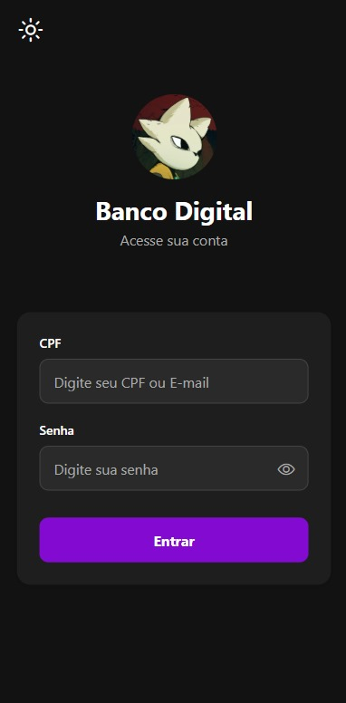
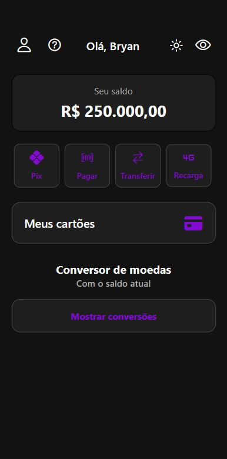
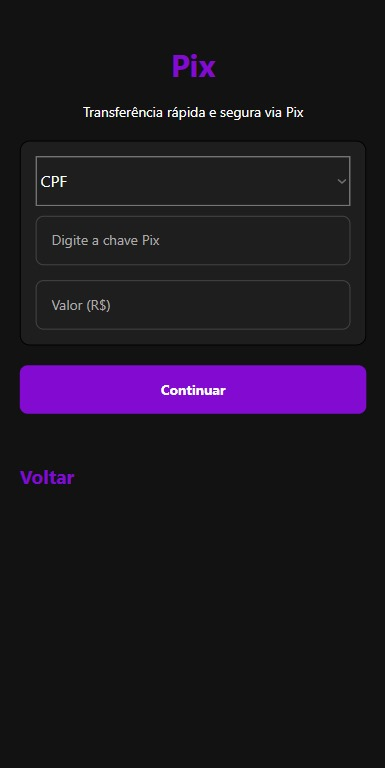
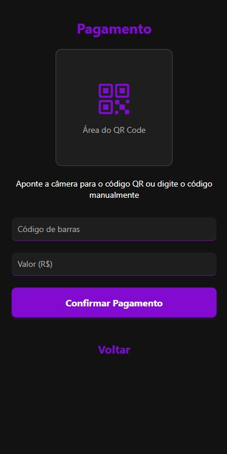
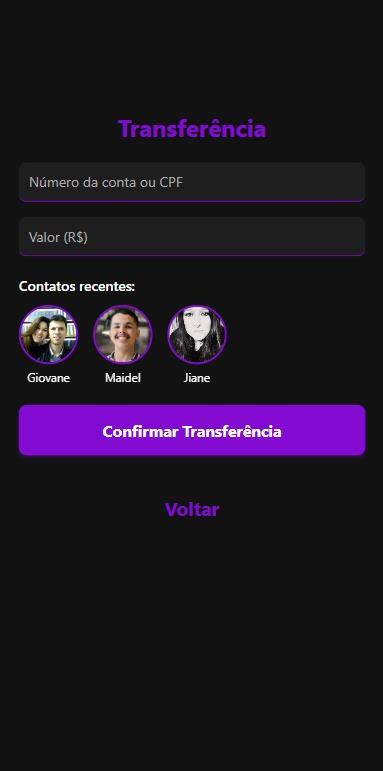
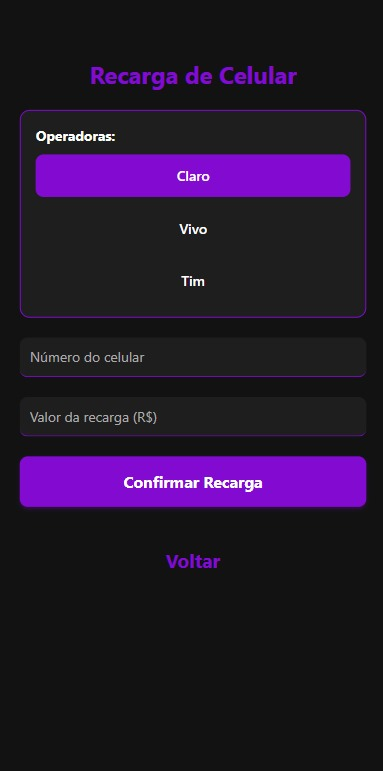
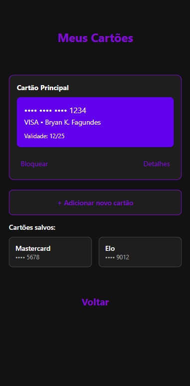
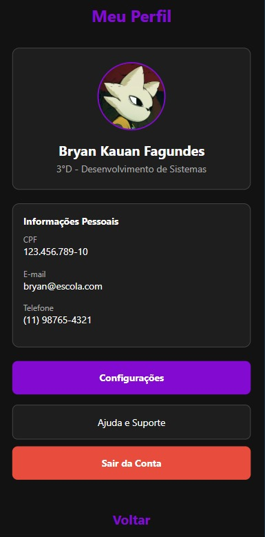
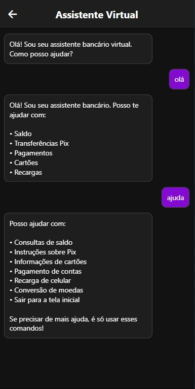

# Banco Digital - App React Native

Aplicativo bancário completo desenvolvido em React Native com todas as funcionalidades essenciais para gerenciamento financeiro.
- Apenas para um projeto escolar, não é 100% funcional por tal motivo.

## Telas do Aplicativo

### 1) Tela de Login
- Autenticação segura com CPF/email e senha
- Toggle para mostrar/esconder senha
- Alternância entre temas claro e escuro

### 2) Tela Principal
- Visão do saldo atual (com opção de ocultar)
- Acesso rápido às principais funcionalidades
- Conversor de moedas integrado

### 3) Pix
- Envio via chave Pix (CPF, email, telefone ou aleatória)
- Validação automática de campos
- Confirmação segura de transações

### 4) Pagamentos
- Leitor de QR Code integrado
- Pagamento por código de barras
- Confirmação instantânea

### 5) Transferência
- Histórico de contatos recentes
- Pagamento por CPF ou número da conta

### 6) Recarga de Celular
- Recarga para todas operadoras (Claro, Vivo, Tim)
- Formatação automática do número

### 7) Cartões
- Gerenciamento de cartões virtuais
- Bloqueio/desbloqueio com um toque
- Detalhes completos de cada cartão

### 8) Perfil
- Informações pessoais protegidas
- Foto do usuário
- Configurações da conta (botão apenas visual, não leva para tela nenhuma)
- Ajuda e suporte
- Opção para sair da conta e voltar para a tela de login

### 9) Assistente Virtual
- Chatbot inteligente para tirar dúvidas
- Respostas automáticas sobre:
  - Saldo e extrato
  - Operações bancárias
  - Cartões e limites
  - Configurações da conta
- Suporte rápido às principais funcionalidades

## Como Usar

1. Faça login com suas credenciais
2. Navegue pelo menu principal
3. Selecione a operação desejada
4. Confirme as informações
5. Operação realizada com sucesso!

## Tecnologias Utilizadas

- React Native
- TypeScript
- Expo
- Styled Components
- API de Conversão Monetária

## Autor

**Bryan Kauan Fagundes**  
3° Ano - Desenvolvimento de Sistemas  

